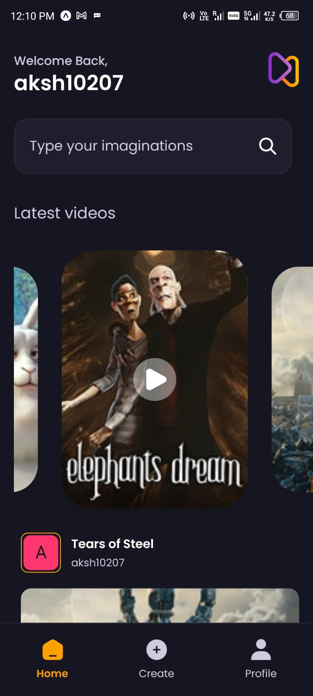
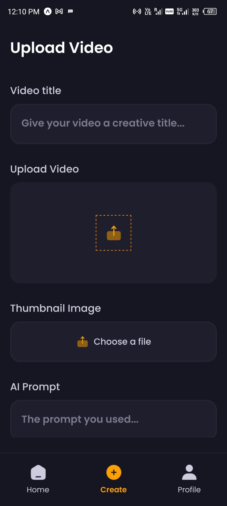

Aora - Full Stack React Native App
==================================

Welcome to the Aora app! This project is a full-stack mobile application where users can share AI-generated videos. It leverages modern technologies like **React Native**, **Expo**, and **Appwrite** for seamless development and scalable functionality. The app features user authentication, file uploads, and a home feed to view recent posts, all while being backed by Appwrite for database management and authentication.

Features
--------

*   **User Authentication:** Secure sign-up and login functionality powered by Appwrite.
*   **File Uploads:** Easily upload and share AI-generated video content with cloud storage provided by Appwrite.
*   **Home Feed:** View a feed of the most recent posts shared by users.
*   **Appwrite Backend:** All backend services like database, authentication, and storage are managed by Appwrite.
*   **React Native:** Cross-platform mobile app development with React Native.
*   **Expo:** Seamless app development and deployment using Expo.
*   **Responsive UI:** Sleek and user-friendly design for a seamless experience.

   ## Screenshots
-----------

## Screenshots
-----------

Below are screenshots showcasing the app's interface:

*   Onboarding Screen  
    

*   Home Feed  
    

*   Profile Page  
    

*   Post Creation  
    

*   Sign In Page  
    

*   Sign Up Page  
    

Installation
------------

1.  Clone the repository:
    
        git clone https://github.com/aksh10207/Aora.git
    
2.  Open the project in your code editor:
    
        cd Aora
    
3.  Install all dependencies:
    
        npm install
    
4.  Run the app using Expo:
    
        npx expo start -c
    
5.  Set up Appwrite backend:
    1.  Follow the [Appwrite documentation](https://appwrite.io/docs) to set up your backend.
    2.  Configure authentication and storage for the Aora app.

Usage
-----

1.  Open the app and create a user account using Appwrite authentication.
2.  Login to your account to access the home feed and upload videos.
3.  Start sharing AI-generated videos with other users and explore posts in the home feed.

Technologies Used
-----------------

*   **React Native:** For building a cross-platform mobile app.
*   **Expo:** For easy development and deployment of the mobile app.
*   **Appwrite:** Backend services for authentication, storage, and database.
*   **Tailwind CSS:** For creating a modern and responsive UI.

License
-------

This project is licensed under the MIT License. For more details, please refer to the [LICENSE](LICENSE) file.

Contact
-------

If you have any questions or suggestions, feel free to reach out to me:

*   **Name:** Akshay Srivastava
*   **GitHub:** [aksh10207](https://github.com/aksh10207)
*   **Email:** [akshaysri0844@gmail.com](mailto:akshaysri0844@gmail.com)
